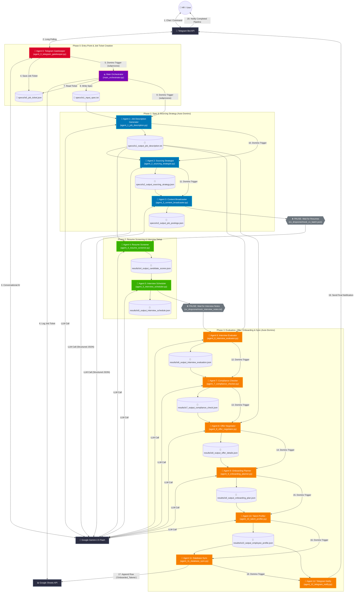
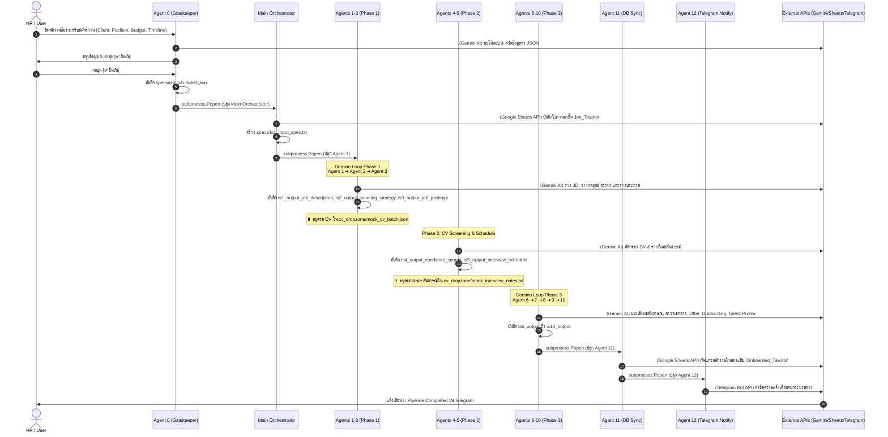

# 🏗️ System Architecture & Process Flow: HR Recruitment Autonomous Pipeline

เอกสารนี้อธิบายสถาปัตยกรรมระบบ (System Architecture) และลำดับกระบวนการทำงาน (Process Flow Diagram) ของระบบ **Harrow Recruitment Process Automation** ตั้งแต่จุดเริ่มต้นการรับเรื่องผ่าน Telegram Bot (`Agent 0`) การรันระบบ Orchestration ไปจนถึงการประมวลผลด้วย Agent ทั้ง 12 ตัว สรุปผลลง Google Sheets และส่งแจ้งเตือนสุดท้ายกลับไปยัง Telegram (`Agent 12`)

---

## 📊 1. Process Block Diagram (Mermaid Flowchart)



---

## 🔄 2. Sequence Diagram (End-to-End Domino Lifecycle)



---

## 📋 3. ตารางรายละเอียดของแต่ละ Module & Agent

| Stage / Module | ไฟล์ Python | ไฟล์ Input (อ่านจาก) | ไฟล์ Output (เขียนลง) | การเรียกใช้ External API / Library | กลไกการส่งไม้ผลัด (Domino Mechanism) |
| :--- | :--- | :--- | :--- | :--- | :--- |
| **Agent 0** | `agent_0_telegram_gatekeeper.py` | Telegram Messages (Interactive) | `specs/is0_job_ticket.json` | Telegram Bot API (`telebot`), Google Gemini (`gemini-2.5-flash`) | เรียก `main_orchestrator.py` ผ่าน `subprocess.Popen` หลังกด [✅ ยืนยัน] |
| **Orchestrator** | `main_orchestrator.py` | `specs/is0_job_ticket.json` | `specs/is1_input_spec.txt`, Google Sheet Row | Google Sheets API (`googleapiclient`) | เรียก `agent_1_job_description.py` ผ่าน `subprocess.Popen` |
| **Agent 1** | `agent_1_job_description.py` | `specs/is1_input_spec.txt` | `specs/is1_output_job_description.txt` | Google Gemini (`gemini-2.5-flash`) | เรียก `agent_2_sourcing_strategist.py` ผ่าน `subprocess.Popen` |
| **Agent 2** | `agent_2_sourcing_strategist.py` | `specs/is1_output_job_description.txt` | `specs/is2_output_sourcing_strategy.json` | Google Gemini (`google.genai`, Pydantic Schema) | เรียก `agent_3_content_broadcaster.py` ผ่าน `subprocess.Popen` |
| **Agent 3** | `agent_3_content_broadcaster.py` | `specs/is2_output_sourcing_strategy.json` | `specs/is3_output_job_postings.json` | Google Gemini (`google.genai`, Pydantic Schema) | **PAUSE** (หยุดรอเรซูเม่หย่อนลง `cv_dropzone/mock_cv_batch.json`) |
| **Agent 4** | `agent_4_resume_screener.py` | `specs/is1_output_job_description.txt`, `cv_dropzone/mock_cv_batch.json` | `results/is4_output_candidate_scores.json` | Google Gemini (`google.genai`, Pydantic Schema) | คายผลลัพธ์ลง `results/` (รันอิสระเมื่อมี CV) |
| **Agent 5** | `agent_5_interview_scheduler.py` | `results/is4_output_candidate_scores.json` | `results/is5_output_interview_schedule.json` | Google Gemini (`google.genai`, Pydantic Schema) | **PAUSE** (หยุดรอผลสัมภาษณ์หย่อนลง `cv_dropzone/mock_interview_notes.txt`) |
| **Agent 6** | `agent_6_interview_evaluator.py` | `specs/is1_output_job_description.txt`, `cv_dropzone/mock_interview_notes.txt` | `results/is6_output_interview_evaluation.json` | Google Gemini (`google.genai`, Pydantic Schema) | เรียก `agent_7_compliance_checker.py` ผ่าน `subprocess.Popen` |
| **Agent 7** | `agent_7_compliance_checker.py` | `results/is6_output_interview_evaluation.json`, `cv_dropzone/mock_documents.txt` | `results/is7_output_compliance_check.json` | Google Gemini (`google.genai`, Pydantic Schema) | เรียก `agent_8_offer_negotiator.py` ผ่าน `subprocess.Popen` |
| **Agent 8** | `agent_8_offer_negotiator.py` | `results/is7_output_compliance_check.json`, `specs/is1_output_job_description.txt`, `cv_dropzone/mock_cv_batch.json` | `results/is8_output_offer_details.json` | Google Gemini (`google.genai`, Pydantic Schema) | เรียก `agent_9_onboarding_planner.py` ผ่าน `subprocess.Popen` |
| **Agent 9** | `agent_9_onboarding_planner.py` | `results/is8_output_offer_details.json` | `results/is9_output_onboarding_plan.json` | Google Gemini (`google.genai`, Pydantic Schema) | เรียก `agent_10_talent_profiler.py` ผ่าน `subprocess.Popen` |
| **Agent 10** | `agent_10_talent_profiler.py` | `results/is9_output_onboarding_plan.json`, `cv_dropzone/mock_cv_batch.json`, `cv_dropzone/mock_interview_notes.txt` | `results/is10_output_employee_profile.json` | Google Gemini (`google.genai`, Pydantic Schema) | เรียก `agent_11_database_sync.py` ผ่าน `subprocess.Popen` |
| **Agent 11** | `agent_11_database_sync.py` | `results/is10_output_employee_profile.json` | Google Sheet Tab `Onboarded_Talents` | Google Sheets & Drive API (`gspread`, Service Account) | เรียก `agent_12_telegram_notify.py` ผ่าน `subprocess.Popen` |
| **Agent 12** | `agent_12_telegram_notify.py` | `results/is10_output_employee_profile.json` | Telegram Chat Notification | Telegram Bot API (`requests` HTTPS POST) | **FINISH** (จบกระบวนการ Pipeline) |

---

## 📁 4. โครงสร้างไดเรกทอรีของแต่ละ Workspace (`config.get_workspace(job_id)`)

เมื่อมี Job ID ใหม่เกิดขึ้น ระบบจะสร้างและแยกเก็บไฟล์ทั้งหมดไว้ใน Workspace เฉพาะตามโครงสร้างดังนี้:

```text
workspaces/
└── {JOB_ID}/                             # เช่น JOB-20260818-59
    ├── specs/                            # เก็บข้อมูลข้อกำหนดและกลยุทธ์ (Stage 0 - 3)
    │   ├── is0_job_ticket.json
    │   ├── is1_input_spec.txt
    │   ├── is1_output_job_description.txt
    │   ├── is2_output_sourcing_strategy.json
    │   └── is3_output_job_postings.json
    ├── cv_dropzone/                      # จุดรับไฟล์จากภายนอก (Drop Zone)
    │   ├── mock_cv_batch.json
    │   ├── mock_interview_notes.txt
    │   └── mock_documents.txt
    └── results/                          # เก็บผลการประเมินและการประมวลผล (Stage 4 - 10)
        ├── is4_output_candidate_scores.json
        ├── is5_output_interview_schedule.json
        ├── is6_output_interview_evaluation.json
        ├── is7_output_compliance_check.json
        ├── is8_output_offer_details.json
        ├── is9_output_onboarding_plan.json
        └── is10_output_employee_profile.json
```

---

## 🛡️ 5. สรุปจุดเชื่อมต่อ External API & Credentials

1. **Telegram Bot API**:
   - **Agent 0**: ใช้ `telebot` (`TELEGRAM_BOT_TOKEN`) รับฟังคำสั่งและโต้ตอบ
   - **Agent 12**: ใช้ `requests` ยิง HTTPS POST ตรงไปยัง `https://api.telegram.org/bot<TOKEN>/sendMessage` เพื่อแจ้งเตือน `TELEGRAM_CHAT_ID`

2. **Google Gemini API (Gemini 2.5 Flash)**:
   - ใช้ `GEMINI_API_KEY` จาก `.env`
   - Agent 0 & Agent 1: ใช้ `google.generativeai` / `genai.GenerativeModel`
   - Agent 2 - Agent 10: ใช้ SDK ใหม่ `google.genai.Client` ร่วมกับ Pydantic Structured Output Schemas (`response_mime_type="application/json"`)

3. **Google Sheets API**:
   - **Main Orchestrator**: ใช้ OAuth User Credentials (`token_sheets.json` / `credentials_gmail.json`) อัปเดตลงชี้ตแท็บ `Job_Tracker`
   - **Agent 11**: ใช้ Service Account Credentials (`gcp_credentials.json`) ผ่าน `gspread` อัปเดตลงชี้ตแท็บ `Onboarded_Talents`
