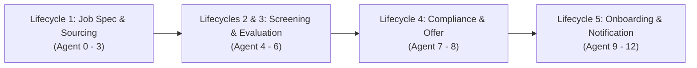
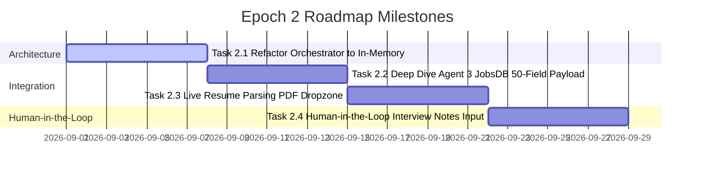

# 🗺️ 12-Agent Recruitment Process Automation: Epoch Roadmap & Evolution Log

> **Project Version**: 1.0.0 (Epoch 1 Completed)  
> **Repository**: `rongrithp/10-agent-hr-pipeline`  
> **Last Updated**: August 2026  

---

## 📌 1. System Overview & Core Philosophy

### 1.1 Project Objective
ระบบ **12-Agent Recruitment Process Automation** ถูกออกแบบเพื่อแปลงกระบวนการสรรหาและคัดเลือกบุคลากรแบบ End-to-End ให้เป็นระบบอัตโนมัติที่ทำงานร่วมกันอย่างสมบูรณ์แบบ ผ่าน Multi-Agent Architecture จำนวน 13 สคริปต์ (Agent 0 ถึง Agent 12) ครอบคลุม 5 Lifecycles หลัก ตั้งแต่การเปิดรับสมัครงานจนถึงการแจ้งเตือนผู้บริหารรับ Onboarding

### 1.2 The 5 Recruitment Lifecycles Architecture

### 1.3 Core Engineering Philosophy & Standards
1. **Dual Output Standard (`.json` + `.md`)**:
   - ทุก Agent จะทำการปล่อย Output 2 รูปแบบเสมอใน Workspace Vault:
     * **Machine-Readable Payload (`.json`)**: สำหรับการส่งต่อข้อมูลระหว่าง Agent ใน Pipeline และบันทึกลง Database
     * **Human-Readable Document (`.md`)**: สำหรับมนุษย์ (HR / Hiring Manager / Executive) อ่าน ตรวจสอบ หรือพิมพ์ออกเป็นเอกสาร
2. **Pydantic Schema Validation & Data Contracts**:
   - ควบคุมโครงสร้างข้อมูลเข้า-ออกของทุก Agent ด้วย Pydantic V2 BaseModels เพื่อสร้าง Data Contracts ที่แข็งแกร่งและป้องกัน Runtime Data Mutation
3. **Workspace Vault Isolation**:
   - การประมวลผลแยกตาม Job Code ในโฟลเดอร์ `workspaces/<JOB-CODE>/` โดยแบ่งเป็น Vault ตามแต่ละ Stage ของ Recruitment Lifecycle (`00_intake_vault/`, `01_job_spec_vault/`, `02_sourcing_dropzone/`, `03_broadcasting_kits/`, `04_candidate_eval_vault/`, `05_onboarding_vault/`)

---

## 🟢 2. Epoch 1: Core Foundation & Data Contracts [COMPLETED]

### 2.1 Overview & Key Milestones
ใน **Epoch 1** ระบบสำเร็จการสร้างรากฐาน Core Pipeline และ Data Contracts ครบถ้วนทั้ง 12 Agents (Agent 0 ถึง Agent 12) และทำการทดสอบ End-to-End Recruitment Cycle พร้อมส่ง Live Broadcast เข้าสู่ Telegram Group ผู้บริหารสำเร็จเรียบร้อย

### 2.2 Agent Summary by Lifecycle

| Lifecycle | Agent ID & Name | Core Responsibility | Primary Output Artifacts | Status |
| :--- | :--- | :--- | :--- | :---: |
| **L1: Job Spec & Sourcing** | **Agent 0**: Telegram Gatekeeper | รับข้อความผ่าน Telegram/CLI เพื่อสร้าง Intake Workspace | `is0_output_job_intake_payload.json` `is0_intake_summary_card.md` | ✅ Completed |
| | **Agent 1**: Job Spec Synthesizer | สังเคราะห์ Job Spec ชัดเจนตามโครงสร้างองค์กร | `is1_output_job_description_payload.json` `is1_job_description_document.md` | ✅ Completed |
| | **Agent 2**: Sourcing Strategist | วางยุทธศาสตร์ค้นหาและกำหนด Channel Matrix | `is2_output_sourcing_strategy_payload.json` `is2_sourcing_strategy_document.md` | ✅ Completed |
| | **Agent 3**: Content Broadcaster | สร้างสื่อประชาสัมพันธ์ตำแหน่งงาน (JobsDB, Social, Email) | `is3_output_broadcasting_content_payload.json` `is3_broadcasting_content_kit.md` | ✅ Completed |
| **L2 & L3: Screening & Evaluation** | **Agent 4**: Resume Screener | คัดกรองและให้คะแนนเรซูเม่เทียบกับ Job Spec | `is4_output_resume_screening_payload.json` `is4_resume_screening_report.md` | ✅ Completed |
| | **Agent 5**: Interview Scheduler | จัดตารางสัมภาษณ์และสร้าง Calendar Invites | `is5_output_interview_schedule_payload.json` `is5_interview_schedule_notice.md` | ✅ Completed |
| | **Agent 6**: Interview Evaluator | ประเมินผลสัมภาษณ์ สรุป Competency Matrix | `is6_output_interview_evaluation_payload.json` `is6_interview_evaluation_report.md` | ✅ Completed |
| **L4: Compliance & Offer** | **Agent 7**: Compliance Checker | ตรวจสอบ Background Check, Reference & Risk Assessment | `is7_output_compliance_check_payload.json` `is7_compliance_check_report.md` | ✅ Completed |
| | **Agent 8**: Offer Negotiator | คำนวณผลตอบแทนและออกร่างสัญญาจ้าง (Offer Letter) | `is8_output_offer_negotiation_payload.json` `is8_offer_letter_document.md` | ✅ Completed |
| **L5: Onboarding & Notification** | **Agent 9**: Onboarding Planner | วางแผนปฐมนิเทศ เตรียม IT Asset & Day-1 Checklist | `is9_output_onboarding_plan_payload.json` `is9_onboarding_plan_document.md` | ✅ Completed |
| | **Agent 10**: Talent Profiler | สรุปโปรไฟล์ผู้สมัครแบบ 360 องศาเพื่อบันทึกคลังผู้มีศักยภาพ | `is10_output_talent_profile_payload.json` `is10_talent_profile_dossier.md` | ✅ Completed |
| | **Agent 11**: Database Sync | บันทึกข้อมูลขึ้น Google Sheets Central DB | `is11_output_database_sync_payload.json` `is11_database_sync_report.md` | ✅ Completed |
| | **Agent 12**: Telegram Notify | สรุปรายงานสุดท้ายและบรอดแคสต์เข้า Telegram Group ผู้บริหาร | `is12_output_notification_payload.json` `is12_telegram_broadcast_card.md` | ✅ Completed |

### 2.3 Critical Technical Challenges & Solutions Solved in Epoch 1
1. **Idempotency Guard Implementation**:
   - ปัญหา: การรัน Pipeline ซ้ำทำให้ไฟล์หรือการ Dispatch Telegram เกิดการส่งข้อความซ้ำซ้อน
   - วิธีแก้ไข: ฝัง Idempotency Check ใน Agent 12 (ตรวจสอบการมีอยู่ของ `is12_output_notification_payload.json`) และระบบ CLI Flag เพื่อควบคุมพฤติกรรม re-run
2. **Telegram Dispatch Encoding & Format Safety**:
   - ปัญหา: Telegram Bot API มีข้อจำกัดสูงเกี่ยวกับการ parse MarkdownV2 (มักล้มเหลวจาก unescaped special characters เช่น `-`, `.`, `!`, `(`, `)`)
   - วิธีแก้ไข: ปรับ Agent 12 ให้ใช้ Plaintext Mode พร้อมกับการจัดเรียง Emoji และ Line Wrapping สวยงาม อ่านง่าย ป้องกัน HTTP 400 Bad Request
3. **Cross-Platform Path Safety & Environment Resilience**:
   - ปัญหา: ปัญหาการอ้างอิง Relative Path ระหว่าง Windows และ POSIX Environments ใน Google Drive Workspace
   - วิธีแก้ไข: ใช้ `pathlib.Path` ใน `config.py` เพื่อทำ Dynamic Path Resolution ให้อ่าน-เขียนไฟล์ใน Vault โฟลเดอร์ได้อย่างถูกต้องเสมอ

---

## 🟡 3. Epoch 2: Platform Integration & Production Inputs [UPCOMING]

### 3.1 Focus & Core Objectives
ยกระดับระบบจาก Prototype Workflow สู่ Production-Grade Operational Pipeline โดยมุ่งเน้นการปฏิรูปความเร็วในการประมวลผล (In-Memory Pipeline), การรองรับข้อมูลจากภายนอกจริง (Real PDF Parser), สื่อประชาสัมพันธ์ 50-field schema สำหรับ JobsDB และอินเทอร์เฟซรับข้อมูล Human-in-the-Loop

### 3.2 Key Roadmap Tasks & Deliverables

#### 🎯 Task 2.1: Refactor `main_orchestrator.py` สู่ In-Memory Direct Pipeline [COMPLETED]
- **Problem**: ปัจจุบันการส่งต่อข้อมูลระหว่าง Agent พึ่งพาการเขียนไฟล์และอ่านไฟล์ `.json` กลับขึ้นมาใหม่ ทำให้เกิด I/O Overhead
- **Target Solution**:
  * ปรับปรับ `main_orchestrator.py` ให้อ่าน/เขียน In-Memory Python Objects (Pydantic models) ระหว่าง Agent execution ได้โดยตรง
  * ยังคงรักษาสัญญาณ Async Disk Write สำหรับบันทึก Audit Logs และ Vault Artifacts (`.json` + `.md`) ไว้สำหรับการตรวจสอบย้อนหลัง
- **Status**: ✅ **COMPLETED** (In-Memory Direct Engine Refactored for 13 Agents across 5 Lifecycles)

#### 🎯 Task 2.2: Deep Dive Agent 3 สำหรับ JobsDB 50-Field Payload & แยกโฟลเดอร์ `03_broadcasting_kits/`
- **Problem**: การประกาศงานในแพลตฟอร์มหลัก เช่น JobsDB/JobStreet ต้องการ Metadata ละเอียดกว่า 50 ฟิลด์ (เช่น Salary Range Code, Job Function Category Code, Work Location Coordinates, Benefits Flags)
- **Target Solution**:
  * พัฒนา `JobsDB50FieldSchema` ใน Pydantic Schema สำหรับ Agent 3
  * จัดสร้างยูนิตจัดเก็บเฉพาะใน Workspace โฟลเดอร์ `workspaces/<JOB-CODE>/03_broadcasting_kits/` แยกประเภท Channel เช่น JobsDB JSON Payload, LinkedIn Banner Copy, Facebook Post, และ Email Notification Templates

#### 🎯 Task 2.3: Live Resume Parsing (PDF Dropzone in `02_sourcing_dropzone/`)
- **Problem**: ปัจจุบัน Resume Screening ใช้ Mock Candidate Payload
- **Target Solution**:
  * พัฒนา PDF Parsing Pipeline ด้วย PyPDF / pdfplumber ร่วมกับ Gemini Structured Output ใน Agent 4
  * กำหนด Dropzone โฟลเดอร์ `workspaces/<JOB-CODE>/02_sourcing_dropzone/` สำหรับการวางไฟล์ PDF Resume หลายไฟล์พร้อมกัน และทำการรัน Batch Screening สรุปเป็น Candidate Scorecard Matrix

#### 🎯 Task 2.4: Human-in-the-Loop Feedback Interface (Interview Notes Input)
- **Problem**: ผลการสัมภาษณ์งานจริงต้องรับมาจากบทสนทนาและบันทึกของกรรมการ (Interviewer Notes)
- **Target Solution**:
  * สร้าง CLI / Form Interface หรือ Webhook สั้นๆ รับ Raw Text / Audio Transcript จากกรรมการสัมภาษณ์บันทึกลงใน `.interview/` โฟลเดอร์
  * ให้ Agent 6 (Interview Evaluator) ทำการสกัด (Extract) คะแนน และ Competency Assessment จากบันทึกจริงเพื่อลงคะแนนตัดสินใจ Hiring Decision

---

## 🔵 4. Epoch 3: Enterprise Automation & Autonomous Ops [FUTURE BACKLOG]

### 4.1 Vision & Long-term Goals
ก้าวสู่การเป็น **Autonomous HR Agent Network** ที่สามารถดำเนินการโพสต์งาน ตรวจสอบผู้สมัคร และวางระบบวิเคราะห์ข้อมูลเชิงลึกได้เองโดยอัตโนมัติในระดับ Enterprise

### 4.2 Future Backlog Features

1. **Headless Browser Automation (Playwright Integration)**:
   - เชื่อมต่อ Playwright สำหรับ Headless Browser Automation ใน Agent 3 เพื่อล็อกอินและอัปโหลด Job Posting Payload ไปยัง JobsDB, LinkedIn Recruiter, และ JobThai โดยอัตโนมัติโดยไม่ต้องพึ่งพามนุษย์กดคีย์ข้อมูล
2. **Advanced Candidate Analytics & Talent Pool Intelligence**:
   - พัฒนา Analytics Dashboard สำหรับวิเคราะห์กระบวนการสรรหา (Time-to-Hire, Conversion Rate ในแต่ละ Stage, Channel Efficiency Index)
   - สร้าง Semantic Search & Vector Database สำหรับค้นหาแคนดิเดตเก่าใน Talent Pool (Agent 10 Dossier) ด้วย Embeddings
3. **Multi-Role Orchestration & Parallel Pipelines**:
   - อัปเกรด Orchestration Layer ให้สามารถรัน Multiple Job Openings พร้อมกันได้แบบ Parallel / Concurrent Executions พร้อมระบบ Priority Queuing และ Central Resource Allocation

---

## 📅 Roadmap Execution Summary Matrix

| Epoch | Objective | Primary Deliverables | Target Timeline | Status |
| :---: | :--- | :--- | :---: | :---: |
| **Epoch 1** | Core Foundation & Data Contracts | 12-Agent Pipeline, Dual Output (.json/.md), Schema Validation, Telegram Live Dispatch | Q3 2026 | ✅ **COMPLETED** |
| **Epoch 2** | Platform Integration & Production Inputs | In-Memory Orchestrator, JobsDB 50-field Schema, PDF Resume Dropzone, Human-in-the-Loop Notes | Q4 2026 | 🟡 **UPCOMING** |
| **Epoch 3** | Enterprise Automation & Autonomous Ops | Playwright Job Board Automation, Vector Talent Search, Multi-Role Parallel Pipeline | Q1 2027 | 🔵 **FUTURE** |
